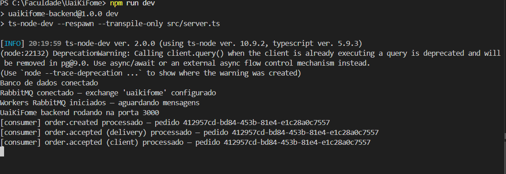
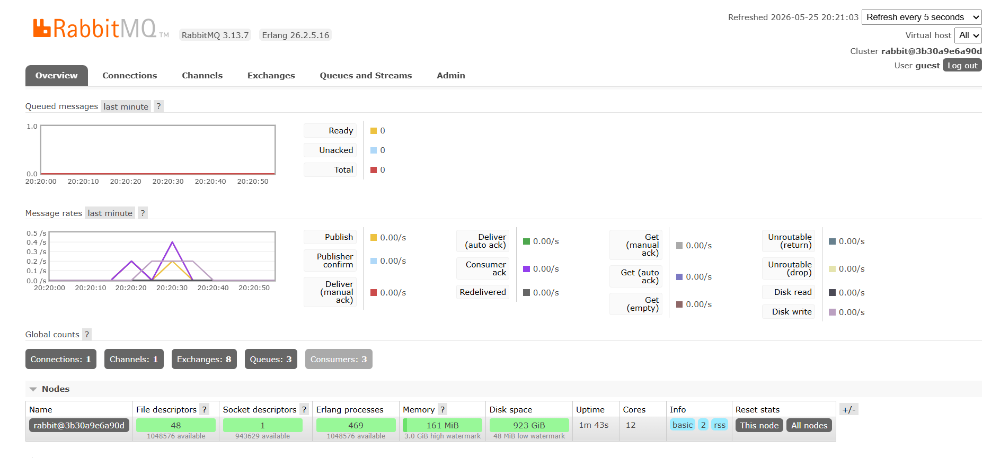

# Sprint 2 — Integração com Middleware Orientado a Mensagens

## 1. Vídeo de demonstração dos eventos de order.created e order.accepted
https://youtu.be/fp4ePh544T8

## 2. Documentação dos Eventos

| Campo | `order.created` | `order.accepted` |
|---|---|---|
| **Nome do evento** | `order.created` | `order.accepted` |
| **Produtor** | `OrderService.create()` | `OrderService.updateStatus()` |
| **Consumidor** | `OrderConsumer` — fila `restaurant_notifications` | `OrderConsumer` — filas `client_notifications` e `delivery_notifications` |
| **Exchange** | `uaikifome` (topic) | `uaikifome` (topic) |
| **Routing key** | `order.created` | `order.accepted` |
| **Momento de publicação** | Após persistir novo pedido no banco | Após transição de status para `ACEITO` |
| **Ação do consumidor** | Persiste `Notification` para o dono do restaurante | Persiste `Notification` para o cliente e para todos os entregadores disponíveis |

### Payload — `order.created`

```json
{
  "orderId": "c2d8cb00-fb11-464e-b3f1-bbb8677a8863",
  "restaurantId": "15af2600-de45-4144-8a56-1111da841275",
  "clientId": "a3f1cc90-12ab-4e77-b902-4321fa098765"
}
```

### Payload — `order.accepted`

```json
{
  "orderId": "c2d8cb00-fb11-464e-b3f1-bbb8677a8863",
  "clientId": "a3f1cc90-12ab-4e77-b902-4321fa098765"
}
```

### Campo `userId` na tabela `notifications`

O campo `userId` armazena o ID de **quem recebe** a notificação, não de quem gerou o evento.

Exemplo para `order.created`: o evento é gerado pelo cliente ao criar um pedido, mas a notificação é destinada ao dono do restaurante. O consumer busca a entidade `Restaurant` pelo `restaurantId` do payload, extrai o `restaurant.userId` (ID do usuário dono) e persiste esse valor. Assim, quando o restaurante faz `GET /notifications`, o endpoint filtra por `userId = req.user.id` e retorna apenas as notificações destinadas a ele.

### Filas e bindings

| Fila | Exchange | Routing key | Consumidor |
|---|---|---|---|
| `restaurant_notifications` | `uaikifome` | `order.created` | Notifica dono do restaurante |
| `client_notifications` | `uaikifome` | `order.accepted` | Notifica cliente do pedido |
| `delivery_notifications` | `uaikifome` | `order.accepted` | Notifica entregadores disponíveis |

---

## 2. Relatório de Integração

### Ferramenta escolhida: RabbitMQ

O RabbitMQ foi escolhido por ser o MOM mais consolidado no mercado para comunicação assíncrona orientada a eventos, com suporte nativo a múltiplos padrões de roteamento, painel de gerenciamento visual (Management UI) e client oficial para Node.js (`amqplib`). Sua configuração via Docker é simples e seu modelo de exchanges e filas se encaixa diretamente na arquitetura do projeto.

### Padrão utilizado: Topic Exchange

Optou-se pelo padrão **Topic Exchange** em vez de Direct Exchange ou Fanout por três razões:

1. **Um único exchange** (`uaikifome`) centraliza todos os eventos do domínio, facilitando o gerenciamento;
2. **Routing keys expressivas** (`order.created`, `order.accepted`) tornam o fluxo auto-documentado;
3. **Extensibilidade**: novos consumidores podem se inscrever em padrões como `order.*` sem modificar os produtores.

As mensagens são configuradas como `persistent: true`, garantindo que não sejam perdidas em caso de reinício do broker.

### Arquitetura de integração

O worker (`OrderConsumer`) é inicializado junto ao servidor Node.js, após a conexão com o banco de dados ser estabelecida. Ele registra handlers assíncronos nas três filas. O produtor (`OrderPublisher`) é chamado dentro dos services após a persistência no banco, com `try/catch` isolado para que uma falha no RabbitMQ não interrompa a resposta REST ao cliente.

A conexão com o RabbitMQ é gerenciada como singleton (`getRabbitMQChannel`) com lógica de retry (5 tentativas, intervalo de 3 segundos), necessária porque o container RabbitMQ demora alguns segundos a mais para inicializar em relação ao backend.

### Desafios encontrados

**RabbitMQ não disponível na inicialização:** o backend inicializava antes do container RabbitMQ estar pronto, causando erro de handshake. Resolvido com lógica de retry na função `getRabbitMQChannel`.

**userId vs restaurantId:** o payload do evento `order.created` carrega o `restaurantId` (ID da entidade `Restaurant`), não o ID do usuário dono. O consumer precisou buscar a entidade `Restaurant` para obter o `userId` correto antes de persistir a notificação.

---

## 3. Comprovação de Funcionamento

### Consumo de mensagens nos workers

O log do servidor abaixo comprova que, ao subir a aplicação (`npm run dev`), a conexão com o banco e com o RabbitMQ é estabelecida, os workers são iniciados e as mensagens são processadas. Para o pedido `412957cd-bd84-453b-81e4-e1c28a0c7557`, observa-se o evento `order.created` sendo consumido e, em seguida, o evento `order.accepted` processado tanto pela fila de entregadores (`delivery`) quanto pela fila do cliente (`client`):



### Painel de gerenciamento do RabbitMQ

O Management UI do RabbitMQ confirma a infraestrutura de integração ativa: **1 exchanges** (`uaikifome`), **3 filas** (`restaurant_notifications`, `client_notifications`, `delivery_notifications`) e **3 consumidores** registrados, correspondentes aos workers da aplicação. O gráfico de *Message rates* registra a publicação e entrega das mensagens, e a métrica *Queued messages* zerada após o processamento comprova que as mensagens foram consumidas e confirmadas (ack) com sucesso:


